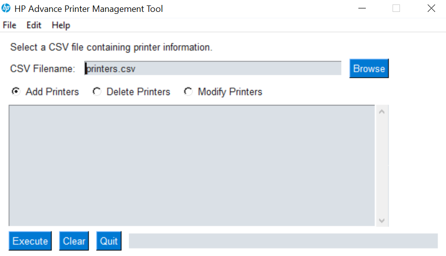

# HP Advance Printer Management Tool
 - GUI tool designed to allow for the mass configuration of devices in HP Advance / LRS VPSX from CSV file. 

## Table of Contents
* [General Info](#general-information)
* [Technologies Used](#technologies-used)
* [Features](#features)
* [Setup](#setup)
* [Usage](#usage)
* [Contact](#contact)

## General Information
- This project was developed for the requirements of presales consultants in the UK&I.
- The project was developed to allow for the mass ingress, modification and purge of devices from HP Advance.
- The project was born from the requirement of having a tool to do mass configuration. At the time LRS did not want to provide the PDDT tool to Presales consultants FOC.
- This project was an educational project to build a tool in Python for self education. 
- LRS now provide the more polished and commercially available PDDT tool to Pre-sale Consultants under NFR.
- This tool provides a front end and csv file that can be feed into the nvpscfg.exe program for HP Advance (VPSX) Configuration.  
- This project is for educational purposes only. 

## Technologies Used
- Python - version 3.8 - https://docs.python.org/3/
    - Modules - https://docs.python.org/3/tutorial/modules.html
        - PySimpleGUI - https://pypi.org/project/PySimpleGUI/
        - clipboard - https://pypi.org/project/clipboard/
        - configparser - https://docs.python.org/3/library/configparser.html
        - csv - https://docs.python.org/3/library/csv.html#module-csv
        - os - https://docs.python.org/3/library/os.html#module-os
        - os.path - https://docs.python.org/3/library/os.path.html
        - datetime - https://docs.python.org/3/library/datetime.html
        - sys -  https://docs.python.org/3/library/sys.html
        - subprocess - https://docs.python.org/3/library/subprocess.html
- Pyinstaller - version 4.2 - https://pyinstaller.readthedocs.io/en/stable/ (Only used to create EXE from *.py files)
- VPSX
    - nvpscfg.exe

## Features
The tool provides the following capabilities:

- Import of Printers from csv format.
- Modification of Printers from csv format.
- Deletion of Printers from csv format.
- Printer Template should be created and configured in VPSX and referenced in CSV file as per example. 
- Output of logging for all functions to txt file.

## Screenshots


## Setup
The project dependencies as are follows;

* Setup the project from source files;

    - Download and install Python 3.8 from https://www.python.org/downloads/

    - Ensure Python is added to environment SYS Path.

    - Install deps from the provided requirements.txt file as per below;
        
        ```
        pip3 install -r requirements.txt
        ```

## Usage
* Running the project from source files;

    - Ensure all Dependencies are installed.
    - Populate the CSV file as per the example entry provided. 
    - Run 
        
        ```
        python main.py
        ```
    - Check Output dir for output and logs for errors. 

## Notes
* Please ensure you add the windows session user to the HP Advance (VPSX) Server configuration for nvpscfg.exe operations. Failure to do so will result in an "unauthorised operation" error message.
* Ensure you create a template printer in HP Advance configured with the settings you want all printers to follow. 
* Ensure you reference the template printer in HP Advance in the printers.csv file as shown in the example. 
* This tool is not an offical HP offering, it was developed as part of my personal education / development.
